# Hi, I'm Michael 👋

### Python Developer · Backend & Automation

Building web applications, API integrations, and tools that simplify everyday work.

---

## 🧑‍💻 About me

- 🐍 My main focus is Python, backend development, and automation.
- 🔌 I enjoy connecting services through APIs and building useful internal tools.
- 🛠️ Interested in the full application lifecycle: data models, business logic, UI, and deployment.
- 🎨 I also work with design and 3D tools.
- ⌨️ Touch typing enthusiast — **110 WPM with 100% accuracy** in a 15-second test.

## ⚡ Tech stack

### Languages

### Backend & APIs

REST APIs · OpenAPI · Webhooks · HTTPX · Requests · asyncio

### Databases & background jobs

### Infrastructure & delivery

Docker Compose · CI/CD · SSH · Gunicorn · Uvicorn

### Testing & code quality

Unit & integration testing · Type hints · pre-commit · Code review

### Data & automation

Data processing · API integrations · Scheduled jobs · Workflow automation

<b>🎨 Design & creative tools</b>

 

---

## 📊 Languages in my repositories

Based on public repository code, not a measure of proficiency.

---

## ⌨️ Beyond the code — Monkeytype

Typing is a daily habit. I practice speed, accuracy, and consistency.

| Timed test | Personal best | Accuracy |
|:-----------|--------------:|---------:|
| 15 seconds | **110 WPM** | **100%** |
| 30 seconds | **105 WPM** | **98%** |
| 60 seconds | **100 WPM** | **98%** |
| 120 seconds | **82 WPM** | **96%** |

**4,431 tests completed** · **78h 21m typing** · **Joined April 2023**

Manually recorded snapshot. Current results are available on my profile.

**[Visit my Monkeytype profile →](https://monkeytype.com/profile/karlMisha)**
